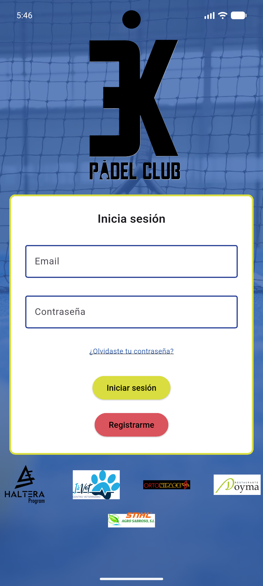
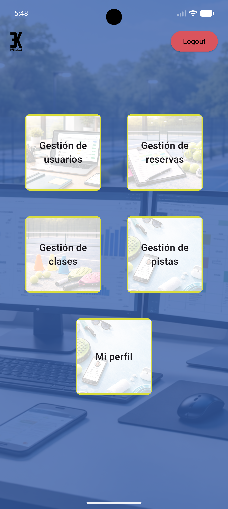
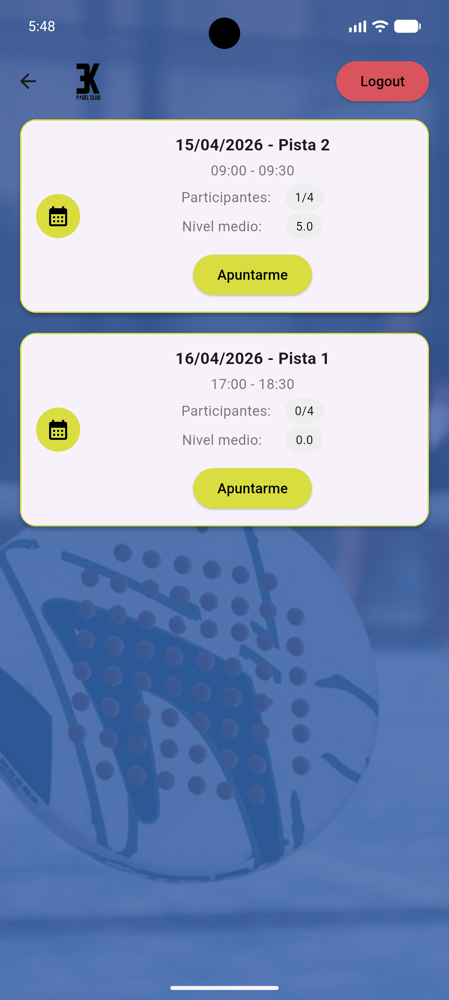
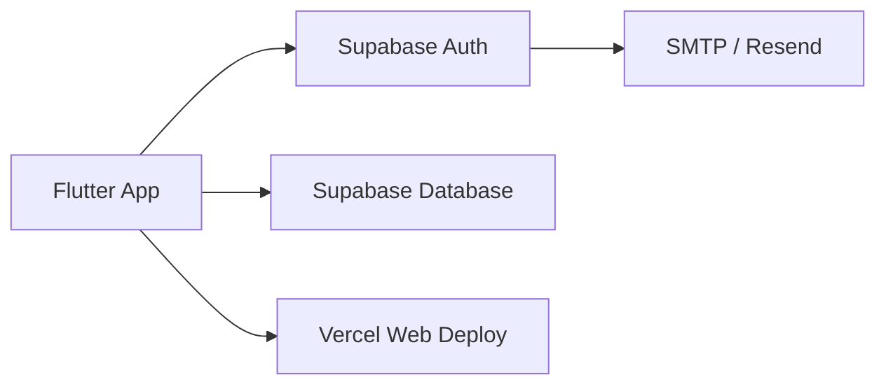

# 3K Padel Club

<p align="center">
  Aplicación multiplataforma para la gestión de usuarios, pistas, reservas y clases de un club de pádel.
</p>

<p align="center">
  
  
  
  
  
  
</p>

---

## Vista general

**3K Padel Club** es una aplicación desarrollada como **Trabajo de Fin de Grado** con el objetivo de digitalizar la gestión interna de un club de pádel.

La solución sustituye procesos manuales basados en mensajería instantánea por una plataforma centralizada que permite:

- gestionar el acceso de usuarios al sistema;
- administrar pistas, reservas y clases;
- controlar permisos según rol;
- mantener la integridad de los datos mediante validaciones y políticas de seguridad;
- ofrecer una experiencia unificada en entorno web y móvil.

---

## Demo

- **Aplicación web**: [Abrir despliegue en Vercel](https://3k-padel-club-zeta.vercel.app)

---

## Capturas de pantalla

> Puedes sustituir estas rutas por tus imágenes reales dentro del repositorio.

<p align="center">
  
  
  
</p>

---

## Características principales

### Usuario

- Registro mediante correo electrónico
- Confirmación de cuenta por email
- Inicio de sesión
- Cumplimentación del perfil en el primer acceso
- Recuperación y cambio de contraseña
- Consulta de reservas activas
- Inscripción y desapuntado en reservas
- Visualización de ocupación de reservas
- Consulta de clases activas asignadas

### Administrador

- Consulta, edición y desactivación de usuarios
- Gestión completa de pistas
- Creación, edición, desactivación y eliminación de reservas
- Gestión de participantes en reservas
- Creación, edición, desactivación y eliminación de clases
- Asignación y desasignación de usuarios a clases

---

## Funcionalidad por roles

| Módulo | Usuario | Administrador |
|---|:---:|:---:|
| Registro y login | ✅ | ✅ |
| Completar perfil | ✅ | ✅ |
| Cambiar contraseña | ✅ | ✅ |
| Ver reservas activas | ✅ | ✅ |
| Apuntarse / desapuntarse a reservas | ✅ | ✅ |
| Ver participantes de reservas | ❌ | ✅ |
| Gestionar usuarios | ❌ | ✅ |
| Gestionar pistas | ❌ | ✅ |
| Gestionar reservas | ❌ | ✅ |
| Gestionar clases | ❌ | ✅ |

> El usuario puede ver la **ocupación** de una reserva, pero no la identidad de los participantes.

---

## Arquitectura

La aplicación sigue una arquitectura **cliente-servidor**:

- **Flutter** gestiona la interfaz, navegación, formularios y control de errores en cliente.
- **Supabase** se encarga de la autenticación, la base de datos, las políticas de acceso y parte de la lógica de control.
- **Resend** se utiliza como servicio SMTP para el envío de correos.
- **Vercel** aloja la versión web de la aplicación.



---

## Tecnologías utilizadas

| Tecnología                       | Uso en el proyecto                                      |
| -------------------------------- | ------------------------------------------------------- |
| **Flutter**                      | Desarrollo del frontend multiplataforma                 |
| **Supabase Auth**                | Registro, login, recuperación y gestión de sesión       |
| **PostgreSQL (Supabase)**        | Persistencia de datos                                   |
| **RLS**                          | Restricción de acceso según rol y operación             |
| **Funciones SQL / lógica en BD** | Validaciones, control de integridad y reglas de negocio |
| **Resend**                       | Envío de correos para autenticación y recuperación      |
| **Vercel**                       | Despliegue de la versión web                            |

---

## Estructura del proyecto

```text
lib/
├── core/
├── features/
│   ├── auth/
│   ├── gestion_pistas/
│   ├── gestion_usuarios/
│   ├── home/
│   ├── perfil/
│   └── reservas/
├── model/
├── services/
├── widgets/
└── main.dart
```

> La estructura puede variar ligeramente según la evolución del proyecto.

---

## Seguridad e integridad

El sistema incorpora diferentes mecanismos para garantizar la protección y coherencia de los datos:

* autenticación delegada en **Supabase Auth**;
* control de acceso basado en roles;
* políticas **RLS** para restringir lectura y escritura;
* funciones en base de datos para prevenir inconsistencias;
* validaciones en frontend y backend;
* control de errores en operaciones críticas.

### Ejemplos de validaciones implementadas

* evitar solapamientos en reservas;
* evitar solapamientos en clases;
* impedir doble inscripción en una misma reserva;
* limitar la capacidad máxima en reservas y clases;
* ocultar información sensible según el rol;
* impedir operaciones no permitidas sobre datos ajenos.

---

## Requisitos previos

Antes de ejecutar el proyecto necesitas disponer de:

* [Flutter](https://flutter.dev/) instalado y configurado
* un proyecto de [Supabase](https://supabase.com/)
* claves de acceso de Supabase
* configuración SMTP en Supabase con Resend
* navegador o emulador Android para pruebas

---

## Instalación

### 1. Clonar el repositorio

```bash
git clone https://github.com/RobertoIzquierdoGomez/3k-Padel-Club.git
cd 3k-Padel-Club
```

### 2. Instalar dependencias

```bash
flutter pub get
```

### 3. Configurar variables y credenciales

Debes definir y conectar correctamente los valores de tu proyecto de Supabase, por ejemplo:

* `SUPABASE_URL`
* `SUPABASE_ANON_KEY`

Además, en Supabase deberás tener configurado:

* el sistema de autenticación;
* la confirmación de cuenta por correo;
* la recuperación de contraseña;
* el proveedor SMTP mediante Resend.

### 4. Preparar la base de datos

Es necesario crear:

* tablas principales;
* relaciones entre entidades;
* políticas RLS;
* funciones y validaciones de negocio.

---

## Ejecución en desarrollo

### Ejecutar en navegador

```bash
flutter run -d chrome
```

### Ejecutar en Android

```bash
flutter run
```

---

## Compilación

### Build web

```bash
flutter build web
```

### Build APK Android

```bash
flutter build apk
```

> La publicación oficial en tiendas no forma parte del alcance actual del proyecto.
> Para Android se contempla la generación de APK para pruebas e instalación manual.
> Para iOS sería necesaria una cuenta de desarrollador y configuración específica de distribución.

---

## Flujo funcional resumido

1. El usuario se registra con correo electrónico.
2. El sistema envía un email de confirmación.
3. Tras autenticarse, el usuario completa su perfil en el primer acceso.
4. El administrador gestiona usuarios, pistas, reservas y clases.
5. El usuario consulta reservas activas y puede apuntarse si hay plazas.
6. El usuario consulta sus clases asignadas.
7. Las políticas y validaciones garantizan permisos e integridad de datos.

---

## Estado actual del proyecto

* [x] Autenticación completa
* [x] Registro y confirmación por correo
* [x] Recuperación de contraseña
* [x] Gestión de usuarios
* [x] Gestión de pistas
* [x] Gestión de reservas
* [x] Gestión de clases
* [x] Control de roles y permisos
* [x] Despliegue web en Vercel

---

## Roadmap / mejoras futuras

* notificaciones más avanzadas para reservas y clases;
* mejoras visuales y de experiencia de usuario;
* publicación móvil formal;
* paneles con estadísticas de uso;
* sistema de historial y trazabilidad más detallado;
* ampliación de filtros y búsquedas.

---

## Documentación

Este repositorio forma parte del desarrollo del TFG:

**Desarrollo de una Aplicación Multiplataforma para la Gestión de un Club de Pádel**

Si lo deseas, puedes acompañar este README con:

* diagramas de arquitectura;
* modelo entidad-relación;
* modelo lógico de datos;
* casos de uso;
* capturas de interfaz;
* memoria final del proyecto.

---

## Autor

**Roberto Izquierdo Gómez**

Trabajo de Fin de Grado
Desarrollo de Aplicaciones Multiplataforma

---

## Licencia

Proyecto desarrollado con fines académicos.